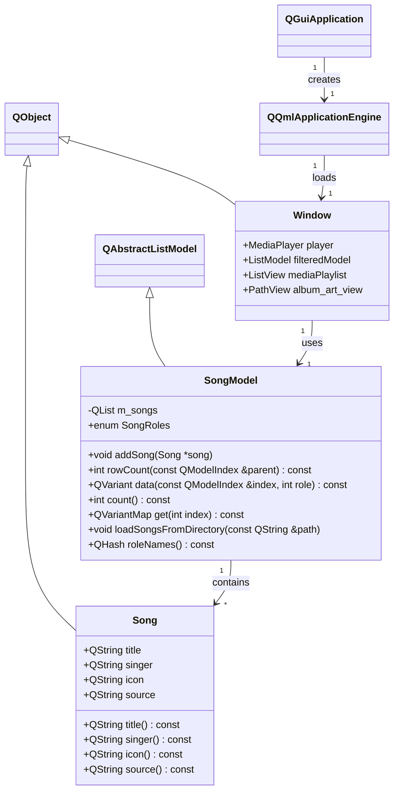
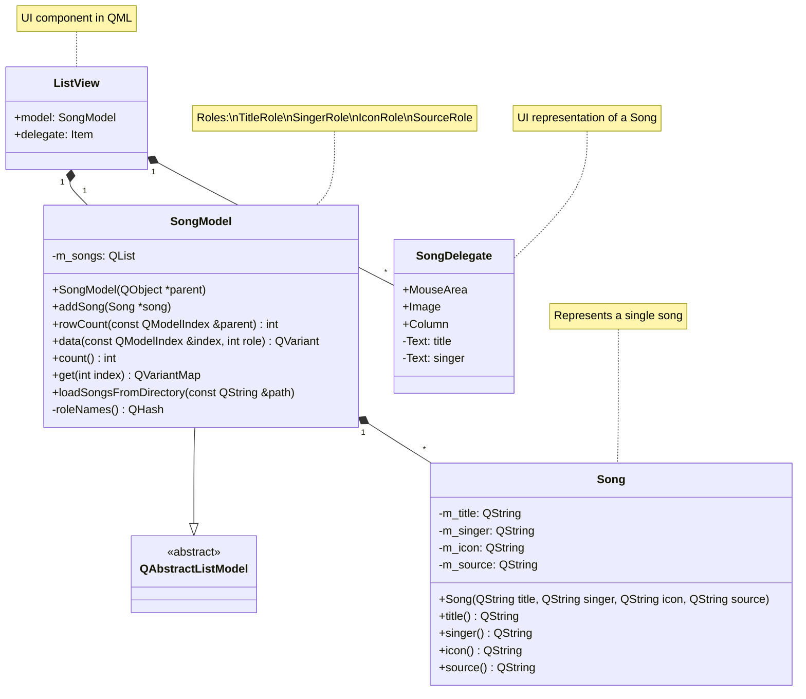

# MediaPlayer-Qt

A simple media player built using Qt and QML. The player supports basic features like playing, pausing, next/previous track, and a search functionality. The purpose is to demonstrate the interfacing between Qml with C++.

## Features

- Play/pause, random, repeat, next and previous track controls
- Playlist panel
- Search with title or singer

## Structure

Using the Qt Subdies Template, the project is organized into the following directories (sub-projects):

- **MediaPlayer/**: Contains the main application source code.
- **MediaPlayer/Component/**: Contains QML files for UI components, including `SwitchButton.qml`, `ButtonControl.qml`, and `SearchOverlay.qml`.
- **MediaPlayer/Lib/**: Contains 3rd-party library, just LibTag (built with MinGW) for now.
- **MediaPlayer/Source/**: Contains the classes `Song` and `SongModel`
- **Test**/: Holds unit tests written using the Qt Test framework, including tests for the Cpp classes in `Test_Cpp` and for qml components in `Test_Qml`.

## Setup

1. Clone the repository:
   ```
   git clone https://github.com/minhckd18/MediaPlayer-Qt.git
   ```
2. Open the project in Qt Creator. The project was originally built with Qt MinGW 5.15.0
3. Build and run.

## UML Diagrams

- General class diagram



- Interfacing C++ Model with ListView in Qml


